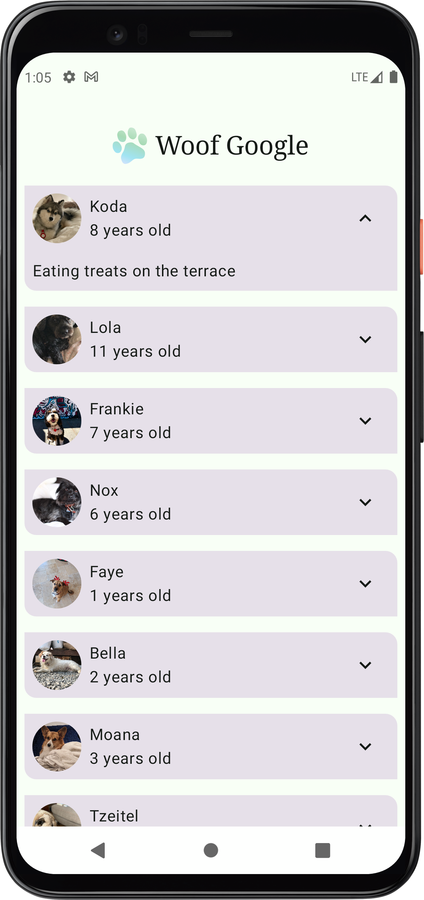
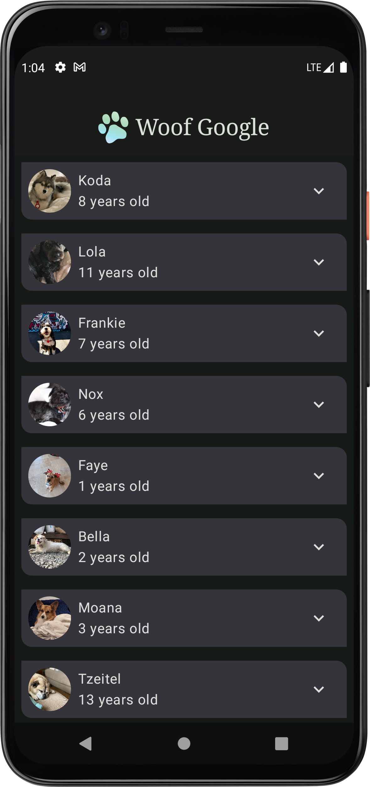

# WoofGoogle

An Open Source Practice App created using the official Android Developers **Material Theming** codelab.

## Note 📝

**This app was developed by following the tutorial:**  
[Build Beautiful App - Android Developers Codelab](https://developer.android.com/courses/pathways/android-basics-compose-unit-3-pathway-3)

## Screenshots 🖼️




## Description 📖

**WoofGoogle** is a sample Android application demonstrating the use of Jetpack Compose and Material Theming.  
This project serves as practice material for developers learning the basics of modern Android app architecture, following the steps provided by the official Android Developers site.

- Built with **Kotlin** and **Jetpack Compose**
- Implements Material Theme for styles and UI consistency
- Follows best practices as outlined in Google’s Compose documentation

## Features ✨

- Modern, material-themed UI
- Jetpack Compose UI components
- Example of theming across app screens
- Learn by exploring and modifying the source code

## Roadmap 🎯

- Expand themes for dark and light mode
- Add more components (Buttons, Cards, etc.)
- Animations and transitions using Compose
- Local data persistence and networking examples

## Building from Source

1. **Clone this repository:**
    ```bash
    git clone https://github.com/43H1-BOI/WoofGoogle.git
    ```
2. **Open in Android Studio or VS Code.**
3. **Sync Gradle and run the app on an emulator or connected device.**

## Issues 🚩

Please report bugs or feature requests via the [GitHub Issue Tracker](https://github.com/43H1-BOI/WoofGoogle/issues).

## License 📜

WoofGoogle is free software distributed under the **GPL v3.0** license.  
See `LICENSE` for details.  
> This project is intended for educational and demonstration purposes only.

## Disclaimer

WoofGoogle is not an official Google product, and is provided as-is for practice and learning.  
All trademarks and copyrights belong to their respective owners.
