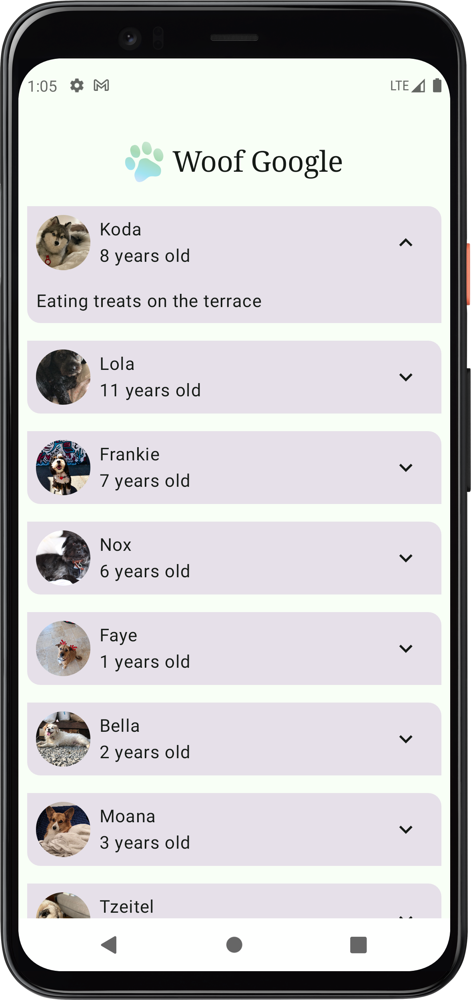
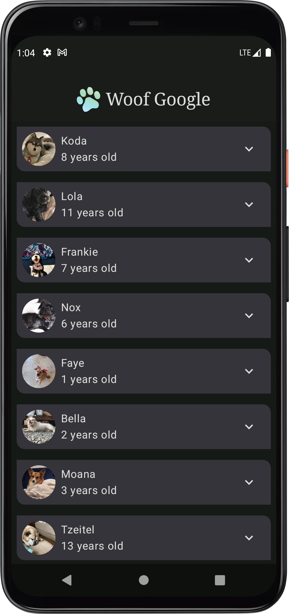

# WoofGoogle 🐕

An Open Source Practice App showcasing a dog profile viewer with modern Android development practices, created by following the official Android Developers **Material Theming** codelab.

## Note 📝

**This app was developed by following the tutorial:**  
[Build Beautiful Apps with Material Design and Jetpack Compose - Android Developers Codelab](https://developer.android.com/courses/pathways/android-basics-compose-unit-3-pathway-3)

## Screenshots 🖼️

| Light Mode | Dark Mode |
|:----------:|:---------:|
|  |  |

## Description 📖

**WoofGoogle** is a sample Android application that displays a scrollable list of adorable dog profiles with expandable cards. Each profile includes a dog's photo, name, age, and detailed information that reveals when you tap on the card.

This project serves as practice material for developers learning modern Android app development, demonstrating:

- **Jetpack Compose** for declarative UI development
- **Material 3 Design** with dynamic theming and automatic dark/light mode support
- **Smooth animations** including expand/collapse transitions and icon rotations
- **State management** using Compose's state APIs (`remember` and `mutableStateOf`)
- **LazyColumn** for efficient scrolling of large lists
- Best practices for modern Android architecture

## Tech Stack 🛠️

- **Language:** Kotlin
- **UI Framework:** Jetpack Compose
- **Design System:** Material 3
- **Minimum SDK:** 29 (Android 10)
- **Target SDK:** 36
- **Build Tool:** Gradle with Kotlin DSL

## Features ✨

- **Interactive Dog Profiles:** Tap on any dog card to expand and view more details
- **Material 3 Theming:** Follows Material Design 3 guidelines with custom color schemes
- **Dark Mode Support:** Automatically adapts to system dark/light mode preference
- **Smooth Animations:** Fluid card expansion and icon rotation animations
- **Edge-to-Edge Display:** Modern full-screen experience with proper insets
- **Efficient Scrolling:** Uses LazyColumn for optimal performance with large lists
- **Custom Shapes:** Unique card shapes with asymmetric rounded corners

## Prerequisites 📋

Before building this app, ensure you have:

- **Android Studio** (Latest stable version recommended)
- **JDK 11** or higher
- **Android SDK** with API level 29 or higher
- **Gradle 8.0+** (included via wrapper)

## Building from Source 🔨

1. **Clone this repository:**
   ```bash
   git clone https://github.com/43H1-BOI/WoofGoogle.git
   cd WoofGoogle
   ```

2. **Open the project:**
   - Launch Android Studio
   - Select "Open an Existing Project"
   - Navigate to the cloned repository and select it

3. **Sync Gradle:**
   - Android Studio will automatically prompt to sync Gradle
   - Wait for the sync to complete successfully

4. **Run the app:**
   - Connect an Android device via USB with USB debugging enabled, or start an Android emulator
   - Click the "Run" button (green play icon) in Android Studio
   - Select your target device
   - The app will build and install automatically

## Project Structure 📁

```
app/src/main/java/com/the43h1/woofgoogle/
├── MainActivity.kt          # Main activity with Compose UI
├── DogData.kt              # Data model and sample dog data
└── ui/theme/
    ├── Color.kt            # Color definitions
    ├── Theme.kt            # Material theme configuration
    └── Type.kt             # Typography definitions
```

## Roadmap 🎯

Future enhancements planned:

- [ ] Add dog breed filtering functionality
- [ ] Implement search feature for dog names
- [ ] Add favorites/bookmarking capability
- [ ] Include more dog profiles with real data
- [ ] Add unit and UI tests
- [ ] Implement data persistence with Room database
- [ ] Add networking example with dog API integration
- [ ] Create custom composables library

## Contributing 🤝

Contributions are welcome! If you'd like to contribute:

1. Fork the repository
2. Create a feature branch (`git checkout -b feature/AmazingFeature`)
3. Commit your changes (`git commit -m 'Add some AmazingFeature'`)
4. Push to the branch (`git push origin feature/AmazingFeature`)
5. Open a Pull Request

## Issues 🚩

Please report bugs or feature requests via the [GitHub Issue Tracker](https://github.com/43H1-BOI/WoofGoogle/issues).

## License 📜

This project is intended for educational and demonstration purposes only.

> **Note:** While this repository mentions GPL v3.0 license in previous versions, no LICENSE file currently exists. If you plan to fork or redistribute this project, please add an appropriate open-source license.

## Acknowledgments 🙏

- Based on the official Android Developers Material Theming codelab
- Dog images and data used for educational demonstration purposes
- Inspired by Google's Material Design 3 guidelines

## Disclaimer ⚠️

WoofGoogle is not an official Google product, and is provided as-is for practice and learning purposes.  
All trademarks and copyrights belong to their respective owners.
